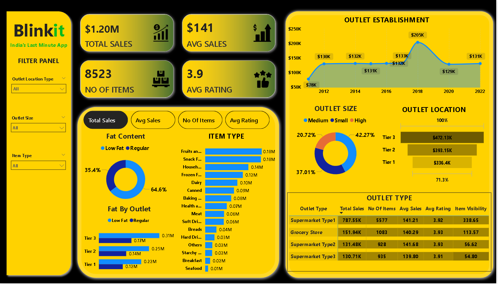

# Blinkit Sales Dashboard

## Overview
The **Blinkit Sales Dashboard** is a Power BI visualization designed to provide key insights into sales performance, outlet distribution, product categories, and overall business metrics. This dashboard helps stakeholders analyze trends, monitor key performance indicators (KPIs), and make data-driven decisions.

## Key Features
- **Sales Performance:** Displays total sales ($1.20M), average sales per transaction ($141), and the total number of items sold (8,523).
- **Customer Feedback:** Shows the average rating (3.9) based on customer reviews.
- **Fat Content Analysis:** Visual representation of products categorized as low-fat vs. regular fat.
- **Outlet Distribution:** Insights into outlet sizes (small, medium, high) and their sales contributions.
- **Item Type Breakdown:** Categorization of items sold, including fruits, snacks, household products, dairy, and more.
- **Outlet Establishment Trends:** Sales trends over the years, highlighting key revenue milestones.
- **Regional Performance:** Sales breakdown across different outlet locations (Tier 1, Tier 2, Tier 3 cities).
- **Outlet Type Comparison:** Performance metrics for different store types such as supermarkets and grocery stores.

## Data Sources
- Sales transaction records
- Customer reviews and ratings
- Outlet information and geographic data
- Product classification details

## Usage
1. **Filtering Options:** Users can apply filters for **Outlet Location Type, Outlet Size, and Item Type** to customize the view.
2. **Interactivity:** The dashboard allows users to interact with different visual components for deeper insights.
3. **Comparative Analysis:** Evaluate the performance of various outlet types and sizes to optimize business decisions.

## Target Audience
- Business Analysts
- Sales & Marketing Teams
- Retail Managers
- Supply Chain Professionals
- Senior Management

## Benefits
- Enhances decision-making with data-driven insights.
- Identifies high-performing outlet locations and product categories.
- Helps optimize inventory based on customer preferences and regional demand.
- Tracks sales trends and outlet growth over time.

## Installation
1. Ensure **Power BI Desktop** is installed.
2. Load the dataset into Power BI.
3. Import the provided `.pbix` file to view and interact with the dashboard.

## Future Enhancements
- Incorporate real-time sales tracking.
- Add predictive analytics for sales forecasting.
- Improve UI with additional drill-down capabilities.
- Integrate external data sources for better market insights.

## Contact
For any inquiries or feedback, please reach out to the **Blinkit Analytics Team**.

